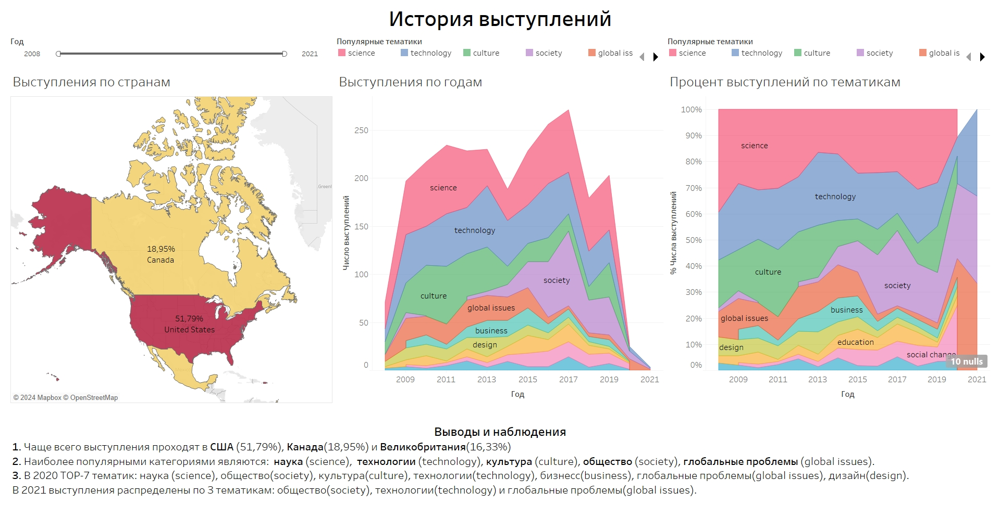
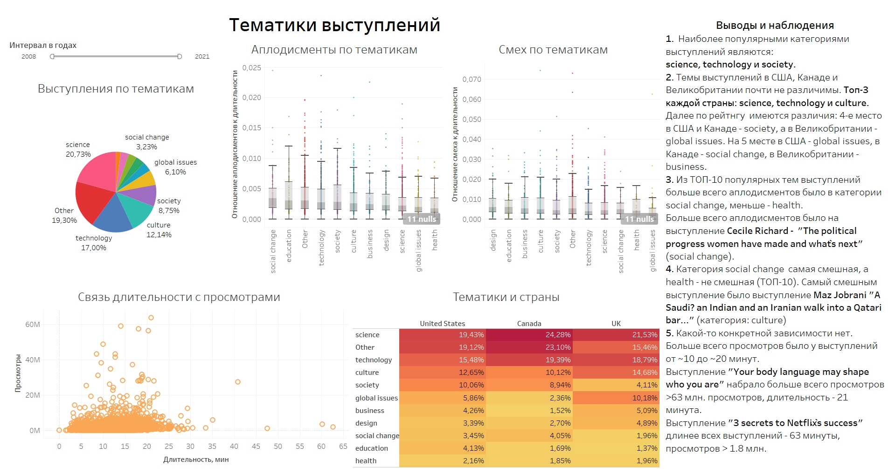
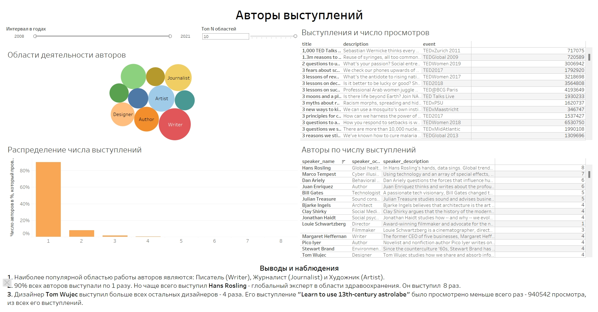
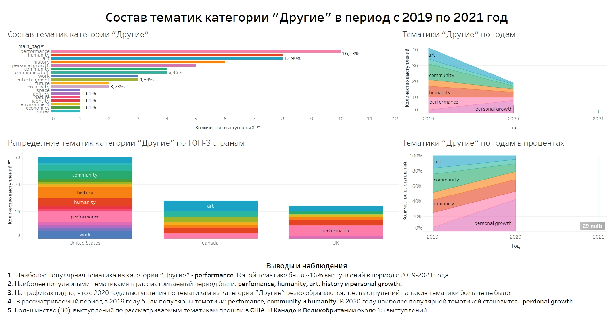

# Создание дашборда по пользовательским событиям для агрегаторановостей
***
## Описание проекта
***
Подготовлен интерактивный дашборд на основе данных о конференциях. 
Для создания дашбордов использован BI-инструмент Tableau.

## Данные
***
**Файлы `tableau_project_data_1.csv`, `tableau_project_data_2.csv`, `tableau_project_data_3.csv`** 

Хранят данные выступлений. У них одинаковая структура:

* `talk_id` — идентификатор выступления;
* `url` — ссылка на запись выступления;
* `title` — название выступления;
* `description` — краткое описание;
* `film_date` — дата записи выступления;
* `duration` — длительность в секундах;
* `views` — количество просмотров;
* `main_tag` — основная категория, к которой относится выступление;
* `speaker_id` — уникальный идентификатор автора выступления;
* `laughter_count` — количество раз, когда аудитория смеялась в ходе выступления;
* `applause_count` — количество раз, когда аудитория аплодировала в ходе выступления;
* `language` — язык, на котором велось выступление;
* `event_id` — уникальный идентификатор конференции.

**Файл `tableau_project_event_dict.csv`**
 
Cправочник конференций. Описание таблицы:

* `conf_id` — уникальный идентификатор конференции;
* `event` — название конференции;
* `country` — страна проведения конференции.

**Файл `tableau_project_speakers_dict.csv`**

Cправочник авторов выступления. Описание таблицы:
* `author_id` — уникальный идентификатор автора выступления;
* `speaker_name` — имя автора;
* `speaker_occupation` — профессиональная область автора;
* `speaker_description` — описание профессиональной деятельности автора.

## Задачи
*** 
TED (от англ. technology, education, design — «технологии, образование, дизайн») — некоммерческий фонд, который проводит популярные конференции. На них выступают специалисты из разных областей и читают лекции на актуальные социальные, культурные и научные темы. Исследуете историю TED-конференций и создадите дашборд в Tableau на основе полученных данных.

## [Ссылка на Tablea Public](https://public.tableau.com/app/profile/ekaterina.plotnikova/viz/TED_17037903395550/TED)
***
1. Дашборд «История выступлений»

2. Дашборд «Тематики выступлений»

3. Дашборд «Авторы выступлений»

4. Дашборд "Состав тематик категории "Другие" в период с 2019 по 2021 год"

## Используемый стек технологий
***
Tableau

## Ключевые слова проекта
***
дашборд, визуализация данных, Tableau
