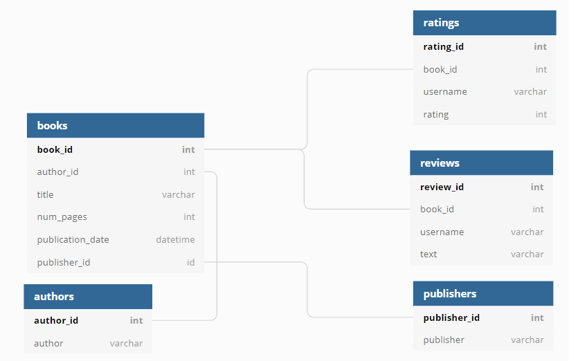

# Исследование базы данных сервиса по чтению книг по подписке.
***
## Описание проекта
Проект направлен на анализ сервиса для чтения книг по подписке. 
***
## Данные 
База данных содержит информацию о книгах, издательствах, авторах и пользовательских обзорах на книги.

**ER-диаграмма базы:**

**Таблица `books`**

Содержит данные о книгах.

|Поле|Описание|
| :---: | :---: |
|book_id|идентификатор книги|
|author_id|идентификатор автора|
|title|название книги|
|num_pages|количество страниц|
|publication_date|дата публикации книги|
|publisher_id|идентификатор издателя|

**Таблица `authors`**

Содержит данные об авторах.

|Поле|Описание|
| :---: | :---: |
|author_id|идентификатор автора|
|author|имя автора|

**Таблица `publishers`**

Содержит данные об издательствах.

|Поле|Описание|
| :---: | :---: |
|publisher_id|идентификатор издательства|
|publisher|название издательства|

**Таблица `ratings`**

Содержит данные о пользовательских оценках книг. 

|Поле|Описание|
| :---: | :---: |
|rating_id|идентификатор оценки|
|book_id|идентификатор книги|
|username|имя пользователя, оставившего оценку|
|rating|оценка книги|

**Таблица `reviews`**

Содержит данные о пользовательских обзорах.

|Поле|Описание|
| :---: | :---: |
|review_id|идентификатор обзора|
|book_id|идентификатор книги|
|username|имя автора обзора|
|text|текст обзора|

## Задачи исследования
***
1. Посчитать, сколько книг вышло после 1 января 2000 года;
2. Для каждой книги посчитать количество обзоров и среднюю оценку;
3. Определить издательство, которое выпустило наибольшее число книг толще 50 страниц, исключая из анализа брошюры;
4. Определить автора с самой высокой средней оценкой книг, учитывая только книги с 50 и более оценками;
5. Посчитать среднее количество обзоров от пользователей, которые поставили больше 48 оценок.

## Используемый стек технологий
***
PostgreSQL, Python, Pandas, Sqlalchemy

## Ключевые слова проекта
***
обработка данных, выгрузка данных, SQL, подключение к БД, 