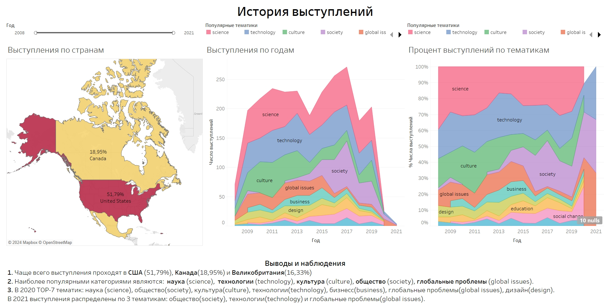
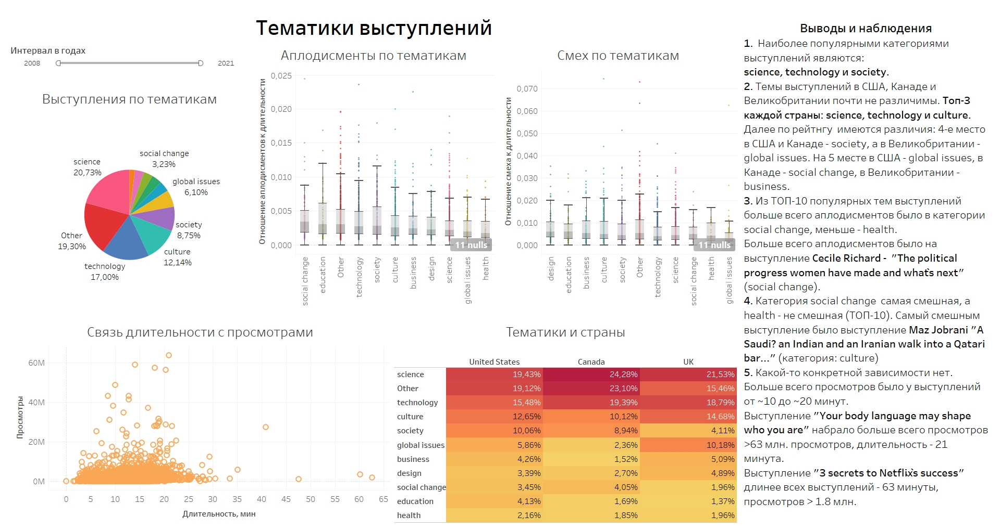
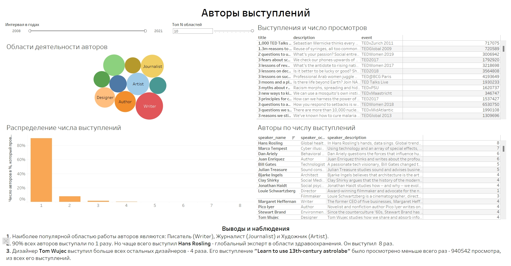
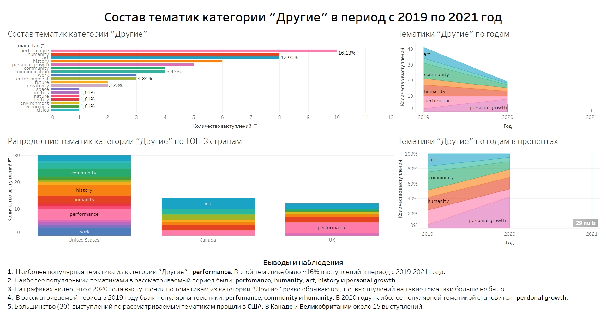

# Создание дашборда по пользовательским событиям для агрегаторановостей
***
## Описание проекта
***
Подготовлен интерактивный дашборд на основе данных о конференциях. 
Для создания дашбордов использован BI-инструмент Tableau.
## Задачи
*** 
Исследовать историю TED-конференций и создать дашборд в 
Tableau на основе полученных данных.

## [Ссылка на Tablea Public](https://public.tableau.com/app/profile/ekaterina.plotnikova/viz/TED_17037903395550/TED)
***
1. Дашборд «История выступлений»

2. Дашборд «Тематики выступлений»

3. Дашборд «Авторы выступлений»

4. Дашборд "Состав тематик категории "Другие" в период с 2019 по 2021 год"

## Используемый стек технологий
***
Tableau

## Ключевые слова проекта
***
дашборд, визуализация данных, Tableau
